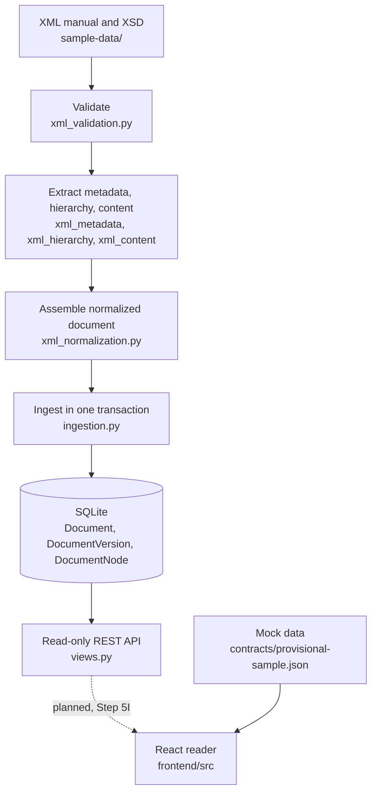

# Pilot EFB

Pilot EFB is a prototype of an iPad-friendly web app that lets pilots read aviation manuals. It is being built for a university consulting project and uses **synthetic (entirely fictional) data only**.

> **Status in one sentence:** the backend can validate an XML manual, store it in a database and serve it through a read-only REST API; the frontend is a working reader that still runs on built-in mock data and is not yet connected to that API.

## Contents

- [Project overview](#project-overview)
- [Features](#features)
- [Technology stack](#technology-stack)
- [Tools and skills used](#tools-and-skills-used)
- [Architecture](#architecture)
- [Folder structure](#folder-structure)
- [How to run the project](#how-to-run-the-project)
- [REST API](#rest-api)
- [XML ingestion workflow](#xml-ingestion-workflow)
- [Frontend architecture](#frontend-architecture)
- [Testing and validation](#testing-and-validation)
- [Known limitations and roadmap](#known-limitations-and-roadmap)
- [Detailed documentation](#detailed-documentation)

## Project overview

### In plain language

- **What "EFB" means.** An Electronic Flight Bag is the tablet a pilot carries in place of paper manuals. "Pilot EFB" is this project's name for a manual reader that runs in a tablet browser.
- **Who it is for.** Pilots reading manuals on an iPad, and the project client and evaluators assessing whether this approach works.
- **The problem.** Manuals are long (the main sample manual has 1,193 topics and about 1,080 PDF pages) and are revised regularly. Pilots need to find the right passage quickly, be sure they are reading the revision that is in force, and follow links that still work after the manual is renumbered.
- **Why XML and PDF both matter.** XML is the structured source: it knows what is a chapter, a caution or a checklist, so the app can show clean, navigable content. PDF is the familiar printed-page rendition, and some small documents (the sample bulletins) exist only as PDF.
- **Why deep links and revisions matter.** Every chapter, section, topic and content block in the XML has a permanent `id`. Its `number` (for example `03.10.2`) is only a position and changes when content moves. A link, bookmark or note must point at the `id`, or it breaks at the next revision. During the overlap when a new revision is approved but not yet effective, the reader must make it obvious which revision is current.

### Technically

The backend validates XML against an XSD with lxml, extracts metadata, hierarchy and content into a normalized structure, and stores it in a relational database through Django. A Django REST Framework API serves a document library, a navigation tree and single-topic content as JSON. React never parses XML.

### Implemented today versus planned

| Implemented and tested | Planned, not built |
|---|---|
| XSD validation, metadata, hierarchy and content extraction | Deep-link resolver endpoint (Step 5H) |
| Normalized document assembly and atomic database ingestion | Frontend calling the live API (Step 5I) |
| Read-only REST API: library, navigation, topic, health | PDF viewer |
| Date-based revision status (current, upcoming, superseded) | Search, annotations, bookmarks |
| React reader UI with navigation, content blocks and checklists, on mock data | Offline/PWA support, authentication |

## Features

Statuses: **Implemented**, **Mock only** (works in the UI against built-in sample data), **Partial**, **Not implemented**.

| Feature | Description | Status | Main files |
|---|---|---|---|
| Document library | List documents and their revisions | Backend: Implemented. Frontend: Mock only (one document, one revision) | `backend/documents/views.py`, `frontend/src/components/DocumentLibrary.tsx` |
| XML ingestion | Load one manual revision into the database from the command line | Implemented | `backend/documents/ingestion.py`, `backend/documents/management/commands/ingest_xml.py` |
| XML validation | Check XML against the XSD with a hardened parser | Implemented | `backend/documents/xml_validation.py` |
| Metadata extraction | Read document identity and the ten `meta` fields | Implemented | `backend/documents/xml_metadata.py` |
| Hierarchy extraction | Chapter → section → topic tree in source order | Implemented | `backend/documents/xml_hierarchy.py` |
| Topic content extraction | Paragraphs, notes, cautions, warnings, lists, tables, checklists, cross-references | Implemented (`melItem` blocks are skipped and reported) | `backend/documents/xml_content.py` |
| Normalized XML assembly | Combine the above into one contract-shaped payload plus a report | Implemented | `backend/documents/xml_normalization.py` |
| Database persistence | Documents, versions and nodes with integrity constraints | Implemented on SQLite. PostgreSQL untested | `backend/documents/models.py`, `backend/documents/migrations/` |
| REST APIs | Read-only JSON endpoints | Implemented (3 document endpoints + health) | `backend/config/urls.py`, `backend/documents/views.py`, `backend/documents/api_errors.py` |
| Chapter/section/topic navigation | Expandable outline | Backend: Implemented. Frontend: Mock only | `backend/documents/views.py`, `frontend/src/components/Reader.tsx` |
| Revision status | Derive current, upcoming, superseded from effective dates | Backend: Implemented. Frontend: Not implemented (status is not displayed) | `backend/documents/revision_status.py` |
| Deep linking | Open a node by permanent ID | Frontend: Mock only (`?nodeId=` within two sample topics). Backend resolver: Not implemented | `frontend/src/components/Reader.tsx`, `frontend/src/data/mockData.ts` |
| PDF viewing | Display PDF manuals | Not implemented (sample PDFs are in the repository) | — |
| Search | Non-generative text search | Not implemented | — |
| Annotations | Notes anchored to node IDs | Not implemented (test-case data only) | `sample-data/revision-keys/annotation_test_cases_Rev1_to_Rev2.json` |
| Bookmarks | Saved places | Not implemented | — |
| Offline/PWA | Service worker, install, offline cache | Not implemented | — |
| Checklists | Challenge/response items | Backend: Implemented. Frontend: Mock only; ticks are held in memory and lost on reload | `backend/documents/xml_content.py`, `frontend/src/components/ContentBlocks.tsx` |
| iPad responsiveness | Layout adapts to tablet sizes | Partial: CSS breakpoints exist; not tested on a real device | `frontend/src/styles.css` |
| Authentication | Sign-in and access control | Not implemented; the API is deliberately open | `backend/config/settings.py` |

## Technology stack

Summary only. Version ranges, evidence and the full list are in [docs/TECH_STACK.md](docs/TECH_STACK.md).

| Layer | Technology | Declared | Installed in the verified run | Purpose |
|---|---|---|---|---|
| Backend | Python | 3.11+ required by the code | 3.14.0 | Language |
| Backend | Django | `>=5.2,<6.0` | 5.2.18 | Web framework, ORM, migrations |
| Backend | Django REST Framework | `>=3.16,<4.0` | 3.18.3 | JSON API |
| Backend | lxml | `>=6.0,<7.0` | 6.1.3 | XML parsing and XSD validation |
| Database | SQLite | Django default | 3.53.4 | Development database |
| Frontend | React / React DOM | `^19.0.0` | 19.3.0 | UI |
| Frontend | TypeScript | `~5.7.2` | 5.7.3 | Static typing |
| Frontend | Vite | `^6.0.0` | 6.4.4 | Dev server and build |
| Frontend | React Router | `^7.0.0` | 7.18.4 | Routing |
| Frontend (dev) | Vitest, Testing Library, jsdom | `^4.1.11`, `^16.1.0`, `^25.0.1` | 4.1.11, 16.3.3, 25.0.1 | Tests |

**Planned, not installed:** PostgreSQL, PDF.js, service workers, IndexedDB and PWA tooling. None of these appear in any dependency file or source file.

## Tools and skills used

| Category | Items | Evidence |
|---|---|---|
| Demonstrated by source code | Python, Django models and migrations, REST API design, XML parsing, XSD validation, relational schema design with constraints, React components, TypeScript, responsive CSS, unit and API testing | `backend/`, `frontend/src/` |
| Development tools confirmed by the repository | Git, GitHub pull requests (11 merged), npm, Claude Code, GitHub Copilot | Commit history, `frontend/package-lock.json`, `CLAUDE.md`, `.github/copilot-instructions.md` |
| Mentioned in documentation only | Oxygen XML Editor (the client's authoring tool) | `sample-data/README.md` |
| Cannot be verified | VS Code or any other editor, continuous integration, linters or formatters | No such configuration is tracked |

Three of the thirteen non-merge commits carry an AI co-author trailer (one Claude, two Copilot). The repository does not record which lines any tool wrote, so no specific code is attributed to them here.

## Architecture



- **Solid arrows are what runs today.** Ingestion is a command-line step; the API reads only from the database and never opens an XML file.
- **The dotted arrow is planned.** The frontend contains no network calls. Everything it shows comes from `contracts/provisional-sample.json`, imported at build time by `frontend/src/data/mockData.ts`.
- **The integration path is prepared.** Vite already proxies `/api` to Django, and the mock data uses the same JSON shapes the API returns.

## Folder structure

```text
pilot-efb/
├── README.md                  This file
├── CLAUDE.md                  Project rules for Claude Code
├── .gitignore
├── .github/
│   └── copilot-instructions.md   The same rules for GitHub Copilot
├── backend/                   Django project (Python)
│   ├── manage.py
│   ├── requirements.txt
│   ├── .env.example
│   ├── config/                Settings, URL routes, WSGI/ASGI entry points
│   └── documents/             The only app: XML pipeline, models, API, tests
│       ├── management/commands/ingest_xml.py
│       └── migrations/
├── frontend/                  React + TypeScript + Vite app
│   ├── index.html
│   ├── package.json, package-lock.json
│   ├── tsconfig.json, vite.config.ts
│   └── src/
│       ├── main.tsx, App.tsx, App.test.tsx, styles.css
│       ├── components/        DocumentLibrary, Reader, ContentBlocks
│       └── data/mockData.ts
├── contracts/                 Shared JSON contract (provisional) and sample
├── docs/                      Project documentation
│   └── decisions/             Reserved for decision records (empty)
└── sample-data/               Synthetic client dataset
    ├── xml/                   8 XML manuals (source of truth)
    ├── pdf/                   8 PDF renditions
    ├── pdf-only/              2 PDF-only bulletins
    ├── schema/                sample-fltpub.xsd
    ├── revision-keys/         Expected differences between revisions
    ├── manifest.json
    └── deep_link_samples.json
```

Every folder and every meaningful file is explained in [docs/REPOSITORY_GUIDE.md](docs/REPOSITORY_GUIDE.md).

## How to run the project

**Prerequisites:** Python 3.11 or newer, Node.js 20 or newer with npm, and Git. No environment variables are required.

### Backend

Run these from the **repository root**.

```sh
python3 -m venv backend/.venv
source backend/.venv/bin/activate        # Windows: backend\.venv\Scripts\activate
python -m pip install -r backend/requirements.txt
python backend/manage.py migrate
python backend/manage.py ingest_xml sample-data/xml/FM-S100_Rev2.xml
python backend/manage.py runserver 127.0.0.1:8000
```

- `migrate` creates `backend/db.sqlite3`, which is ignored by Git.
- `ingest_xml` loads one manual revision. The library is empty until you run it. Add `--replace` to re-ingest a revision that is already stored.
- Run the backend tests with `python backend/manage.py test documents`.

### Frontend

Run these from the **`frontend/` directory**, in a second terminal.

```sh
npm install
npm run dev        # development server; open the URL it prints
npm test           # run the test suite once
npx tsc -b         # type check only
npm run build      # type check, then production build into frontend/dist/
```

The frontend runs without the backend, because it currently reads mock data.

### How the `/api` proxy works

`frontend/vite.config.ts` tells the Vite development server to forward any request whose path starts with `/api` to `http://127.0.0.1:8000`, where Django listens. The browser only ever talks to Vite, so frontend code can use relative URLs such as `/api/documents/` with no cross-origin setup. The proxy exists only in `npm run dev`; it is not part of a production build, and no frontend code uses it yet.

Full setup notes and troubleshooting are in [docs/DEVELOPMENT_GUIDE.md](docs/DEVELOPMENT_GUIDE.md).

## REST API

All endpoints are read-only (`GET` and `HEAD`), return JSON, and need no authentication.

| Method | Endpoint | Purpose |
|---|---|---|
| GET | `/api/health/` | Liveness check; returns `{"status": "ok"}` |
| GET | `/api/documents/` | Document library: every stored document with its revisions and derived status |
| GET | `/api/documents/{docId}/revisions/{revision}/navigation/` | Complete chapter → section → topic outline for one revision |
| GET | `/api/documents/{docId}/revisions/{revision}/topics/{topicId}/` | One topic with all content blocks in source order |

Path parameters: `docId` is the document's permanent ID (for example `FM-S100`), `revision` is a whole number, `topicId` is the topic's permanent ID (for example `fm100-t1193`).

```sh
curl http://127.0.0.1:8000/api/documents/
curl http://127.0.0.1:8000/api/documents/FM-S100/revisions/2/navigation/
curl http://127.0.0.1:8000/api/documents/FM-S100/revisions/2/topics/fm100-t1193/
```

Every error uses one shape, `{"error": {"code": "...", "message": "..."}}`:

| HTTP status | Code | When |
|---:|---|---|
| 400 | `INVALID_REQUEST` | Revision is not a whole number, or an ID contains a null byte |
| 404 | `DOCUMENT_NOT_FOUND` | Unknown `docId` |
| 404 | `REVISION_NOT_FOUND` | The document exists but not that revision |
| 404 | `NODE_NOT_FOUND` | No node with that ID in the revision |
| 404 | `NODE_NOT_A_TOPIC` | The ID belongs to a chapter or section |
| 404 | `NOT_FOUND` | No such API route |
| 405 | `METHOD_NOT_ALLOWED` | Any write method |
| 500 | `INTERNAL_ERROR` | Unexpected failure; details are logged, never returned |

**Not implemented:** the deep-link resolver `GET /api/documents/{docId}/resolve-node/` described in the contract. Requesting it today returns `404 NOT_FOUND`.

Response shapes and examples are in [docs/BACKEND_GUIDE.md](docs/BACKEND_GUIDE.md#rest-api).

## XML ingestion workflow

The pipeline was built in small steps. "Step 5A" to "Step 5I" are milestone names from the project plan. They are not identifiers in the code: no module, function or command is named after a step. The mapping of each name to a module follows the build order in `CLAUDE.md` and the order of the merged pull requests.

| Step | What it does | Module |
|---|---|---|
| 5A | Validate the XML against `sample-data/schema/sample-fltpub.xsd` with a parser that blocks external entities, DTDs and network access | `backend/documents/xml_validation.py` |
| 5B | Extract root identity and the ten `meta` fields; reject a root `id`/`docType` that disagrees with `meta` | `backend/documents/xml_metadata.py` |
| 5C | Extract chapters, sections and topics in source order with permanent IDs and parent links | `backend/documents/xml_hierarchy.py` |
| 5D | Extract each topic's content blocks, check for duplicate IDs and unresolved cross-references | `backend/documents/xml_content.py` |
| 5E | Assemble one normalized payload plus an ingestion report | `backend/documents/xml_normalization.py` |
| 5F | Write document, version and nodes in one atomic transaction, then verify the stored tree | `backend/documents/ingestion.py` |

Key guarantees: permanent IDs are stored exactly as they appear in the XML and are never generated; a failed ingestion writes nothing; a revision already stored is refused unless `--replace` is given; and every read of a version re-checks tree integrity. Details are in [docs/BACKEND_GUIDE.md](docs/BACKEND_GUIDE.md#xml-processing-pipeline).

## Frontend architecture

- **Entry point:** `frontend/index.html` loads `src/main.tsx`, which renders `App` in React strict mode.
- **Routing** (`src/App.tsx`): `/` shows the document library, `/reader/:docId/:revision` shows the reader, and any other path falls back to the library.
- **Document library** (`src/components/DocumentLibrary.tsx`): one card per document revision with an "Open reader" link.
- **Reader** (`src/components/Reader.tsx`): a toolbar, a collapsible chapter/section/topic outline, and the selected topic.
- **Content blocks** (`src/components/ContentBlocks.tsx`): renders paragraphs, note/caution/warning callouts, lists, tables and interactive checklists, plus inline cross-reference links.
- **Mock data** (`src/data/mockData.ts`): TypeScript types and four functions that serve `contracts/provisional-sample.json`. It offers one document (FM-S100 Rev 2) and two topics.
- **Deep links:** `/reader/FM-S100/2?nodeId=<id>` opens the containing topic, scrolls to the target and highlights it briefly. Resolution is local and limited to the two mock topics.
- **Revision selection:** there is no revision switcher; each revision appears as its own library card.
- **Responsive layout** (`src/styles.css`): the outline is a slide-in drawer on narrow screens and a fixed sidebar from 900px wide, or from 760px in landscape.

**Still requires backend integration:** replacing the mock functions with calls to the API, loading and error states, showing revision status, and deep-link resolution against the full manual. See [docs/FRONTEND_GUIDE.md](docs/FRONTEND_GUIDE.md).

## Testing and validation

Results from the run performed while writing this documentation (macOS, Python 3.14.0, Node.js 22.23.3):

| Suite | Command | Result |
|---|---|---|
| Backend | `python backend/manage.py test documents` | 121 tests passed |
| Frontend | `npm test` | 10 tests passed |
| Type check | `npx tsc -b` | No errors |
| Production build | `npm run build` | Succeeded |
| Manual smoke test | `migrate`, `ingest_xml` for all eight sample manuals, then `curl` against each endpoint | All ingested and served as documented |

- **Backend tests** (`backend/documents/tests.py`, `backend/documents/test_api.py`) cover each pipeline step against the real FM-S100 Rev 2 file, failure and rollback paths, database constraints, every endpoint and error code, query counts and response shapes against the contract sample.
- **Frontend tests** (`frontend/src/App.test.tsx`) cover the library, navigation, each block type, checklist interaction, deep-link scroll and highlight, and cross-reference links, all against mock data.

**Not tested:** PostgreSQL, real iPad or any physical device, real browsers (tests use jsdom), end-to-end frontend-to-backend flows, performance under load, accessibility audits, and production deployment. There is no continuous integration.

## Known limitations and roadmap

Remaining work, in no committed order and with no dates assigned:

- **Step 5H, deep-link resolver.** No backend endpoint resolves a permanent ID to its topic. Content blocks are stored as JSON inside their topic, so block-level lookup needs a design decision.
- **Step 5I, live frontend integration.** The frontend makes no API calls.
- **PDF viewer.** Not started. The sample PDFs contain no permanent-ID destinations, so ID-to-PDF mapping is unresolved (see `docs/xml-inspection.md`).
- **Offline/PWA, search, annotations, bookmarks, authentication.** Not started.
- **`melItem` content.** Skipped during ingestion, so each MEL-S100 topic is served with its paragraph but without its MEL item.
- **iPad testing.** No real-device testing has been done.
- **PostgreSQL.** Never configured or tested; settings use SQLite only.
- **Contract updates.** `contracts/provisional-contract.md` still labels every endpoint "PROPOSED, not implemented" and its error table differs from the implemented one. It can change only with approval.
- **Configuration.** `backend/config/settings.py` hardcodes development values; `backend/.env.example` is not read by any code.

The full status, including open technical decisions, is in [docs/PROJECT_STATUS.md](docs/PROJECT_STATUS.md).

## Detailed documentation

| Document | Contents |
|---|---|
| [docs/REPOSITORY_GUIDE.md](docs/REPOSITORY_GUIDE.md) | Every folder and meaningful file, and how they relate |
| [docs/TECH_STACK.md](docs/TECH_STACK.md) | Technologies, declared ranges, installed versions and evidence |
| [docs/BACKEND_GUIDE.md](docs/BACKEND_GUIDE.md) | Django architecture, XML pipeline, data model, API, errors, tests |
| [docs/FRONTEND_GUIDE.md](docs/FRONTEND_GUIDE.md) | React architecture, components, types, mock data, styling, tests |
| [docs/DEVELOPMENT_GUIDE.md](docs/DEVELOPMENT_GUIDE.md) | Setup, commands, Git workflow, troubleshooting, contributing |
| [docs/PROJECT_STATUS.md](docs/PROJECT_STATUS.md) | Implemented, planned, limitations and open decisions |
| [docs/xml-inspection.md](docs/xml-inspection.md) | Inspection report on the FM-S100 Rev 2 dataset |
| [contracts/provisional-contract.md](contracts/provisional-contract.md) | Provisional JSON contract shared by frontend and backend |
| [sample-data/README.md](sample-data/README.md) | The client's description of the synthetic dataset |
