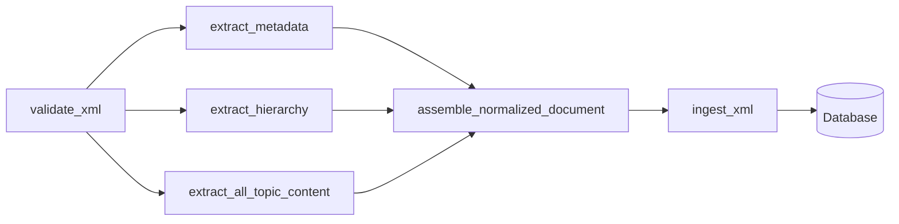
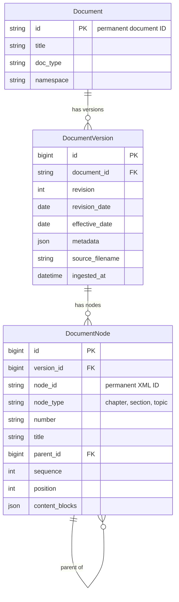

# Backend guide

The backend turns an XML manual into database rows and serves those rows as JSON. It lives in `backend/` and is a standard Django project with one app, `documents`.

- [Django architecture](#django-architecture)
- [XML processing pipeline](#xml-processing-pipeline)
- [Database models](#database-models)
- [Ingestion workflow](#ingestion-workflow)
- [REST API](#rest-api)
- [Error handling](#error-handling)
- [Tests](#tests)

## Django architecture

| Part | Path | Role |
|---|---|---|
| Project package | `backend/config/` | Settings, URL routes, WSGI and ASGI entry points |
| App | `backend/documents/` | Everything else: XML pipeline, models, ingestion, API, tests |
| Command-line entry | `backend/manage.py` | Runs Django commands with `config.settings` |

Points worth knowing in `backend/config/settings.py`:

- **Database:** SQLite at `backend/db.sqlite3`. Nothing else is configured.
- **Development values are hardcoded:** `DEBUG = True`, a placeholder secret key, and `ALLOWED_HOSTS` of `127.0.0.1`, `localhost` and `testserver`. The file reads no environment variables, so `backend/.env.example` currently has no effect.
- **REST framework:** JSON renderer and parser only, no authentication classes, `AllowAny` permission, and a custom exception handler. A code comment states that the open API is deliberate for the prototype.
- **Middleware:** Django's defaults plus `documents.api_errors.ApiNotFoundMiddleware`.
- **Time zone:** `UTC`. Revision status uses this to decide what "today" is.
- **Admin:** `/admin/` is routed, but the app registers no models with it.

## XML processing pipeline

Each step is a separate module that can be called on its own. The "Step 5A" to "Step 5F" headings below are milestone names from the project plan, not identifiers that appear in the code. Every extractor validates the file first and returns a result object carrying `is_valid` and a list of `XmlValidationIssue` (line, column, message) instead of raising.



### Step 5A: validation — `backend/documents/xml_validation.py`

- `secure_xml_parser()` builds an lxml parser with entity resolution, DTD loading, network access, error recovery and huge-tree support all switched off. Every module that parses XML uses it.
- `validate_xml(xml_path=None, xsd_path=None)` parses the XSD, parses the XML, and validates one against the other. It returns `ValidationResult(is_valid, errors)`.
- Defaults: `DEFAULT_XML_PATH` is `sample-data/xml/FM-S100_Rev2.xml` and `DEFAULT_XSD_PATH` is `sample-data/schema/sample-fltpub.xsd`, both resolved from the repository root.
- Handled failures: unreadable XML or XSD file, malformed XML, an invalid XSD, and a well-formed document that breaks the schema. Each is reported with a line number where lxml provides one.

### Step 5B: metadata — `backend/documents/xml_metadata.py`

- `extract_metadata(xml_path=None)` returns `MetadataExtractionResult` holding an `ExtractedDocumentMetadata` dataclass.
- It reads the root `id`, root `docType`, the namespace, and the ten `meta` fields: `docId`, `title`, `docType`, `applicability`, `revision`, `revisionDate`, `effectiveDate`, `owner`, `changeSummary`, `classification`.
- Text values are trimmed at both ends. `revision` becomes an integer and the two dates become `date` objects.
- **Extra rule beyond the XSD:** the root `id` must equal `meta/docId`, and the root `docType` must equal `meta/docType`. A mismatch is rejected.

### Step 5C: hierarchy — `backend/documents/xml_hierarchy.py`

- `extract_hierarchy(xml_path=None)` returns `HierarchyExtractionResult` with two views of the same data:
  - `nodes`: a flat list in document order. Each entry has `id`, `nodeType` (`chapter`, `section` or `topic`), `number`, `title`, `parentId` and `sequence` (position among its siblings, starting at 1).
  - `navigation`: the nested chapters → sections → topics shape used by the API.
- `build_navigation(nodes)` converts the flat list to the nested shape and raises `ValueError` if a section or topic refers to an unknown parent.
- Titles are trimmed. IDs and numbers are copied unchanged.

### Step 5D: topic content — `backend/documents/xml_content.py`

`extract_all_topic_content(xml_path=None)` walks the document once and returns `ContentExtractionResult` with `topics`, `skipped_blocks` and `errors`. `extract_topic_content(topic_id, xml_path=None)` returns a single topic using the same traversal.

| XML block | JSON produced |
|---|---|
| `para`, `note`, `caution`, `warning` | `{type, id, segments}`. Segments are ordered `{type: "text", text}` and `{type: "xref", targetId, text}` entries, so text before, inside and after a cross-reference stays in order |
| `list` | `{type: "list", id, items}` where `items` is a list of strings |
| `table` | `{type: "table", id, rows}`. Each row has `cells`; `header` is included only when the XML row has a `header` attribute |
| `checklist` | `{type: "checklist", id, checks}`. Each check keeps its own permanent `id`, `challenge` and `response` |
| `melItem` | Not converted. Recorded as a `SkippedContentBlock(type, id, topic_id)` |

Additional checks performed here:

- **Duplicate IDs:** any repeated `id` on an addressable element is reported.
- **Cross-references:** every `xref` target must match an `id` somewhere in the same document. A missing or empty target is reported.
- **Namespace:** anything other than `urn:sample:fltpub:1.0` is rejected.
- **Whitespace:** block text is kept exactly as parsed. It is not trimmed or normalized.

### Step 5E: normalized assembly — `backend/documents/xml_normalization.py`

`assemble_normalized_document(xml_path=None)` runs the three extractors and returns a dictionary with two siblings:

- `payload`: `document` (`id`, `namespace`, `docType`), `version` (`revision` and the full `metadata` object), `chapters` (navigation tree) and `topicContentById` (topic content keyed by permanent topic ID). It is `None` on failure.
- `ingestionReport`: `is_valid`, `errors`, `unresolvedXrefs` and `skippedBlocks`. Diagnostics stay here and never mix into the payload.

It also confirms that the topics in the hierarchy and the topics in the content match one-to-one by ID. If the only problems are unresolved cross-references, the payload is still built so they can be inspected, but the report stays invalid and ingestion will refuse it.

Implementation note: each extractor validates and parses the file independently, so one assembly reads the XML several times. This is a simplicity trade-off, not a correctness issue.

## Database models

Defined in `backend/documents/models.py`, created by the three migrations in `backend/documents/migrations/`.



| Model | Represents | Notes |
|---|---|---|
| `Document` | One logical manual, such as `FM-S100` | The primary key is the permanent document ID from the XML |
| `DocumentVersion` | One revision of a document | Stores all ten `meta` fields as JSON. Unique on (`document`, `revision`) |
| `DocumentNode` | One chapter, section or topic in one version | `node_id` is the permanent XML ID. `position` is the order in the whole document; `sequence` is the order among siblings. Only topics have `content_blocks` |

Things to understand about the design:

- **Permanent IDs are scoped to a version.** The same `node_id` appears once per revision, which is how a topic can move or change between revisions while keeping its identity.
- **Content blocks are not rows.** Paragraphs, tables, checklists and individual checks are stored as JSON inside their topic's `content_blocks`. They keep their permanent IDs, but the database cannot look one up directly.
- **Revision status is not stored.** It is calculated on each request.

Integrity rules enforced by the database:

| Constraint | Rule |
|---|---|
| `unique_document_revision` | One row per document and revision |
| `unique_version_node_id` | A permanent ID appears once per version |
| `unique_version_position` | No two nodes share a document position |
| `unique_version_parent_sequence` | Siblings have distinct sequence numbers |
| `unique_version_root_sequence` | Chapters (which have no parent) have distinct sequence numbers |
| `documentnode_valid_parent_reference` | Chapters have no parent; sections and topics must have one |

`DocumentNode.clean()` adds model-level checks for parent type, same-version parents and cycles. All relations cascade on delete.

## Ingestion workflow

Run from the repository root:

```sh
python backend/manage.py ingest_xml sample-data/xml/FM-S100_Rev2.xml
python backend/manage.py ingest_xml sample-data/xml/FM-S100_Rev2.xml --replace
```

The command (`backend/documents/management/commands/ingest_xml.py`) calls `ingest_xml(xml_path, replace=False)` in `backend/documents/ingestion.py`, which does the following:

1. **Assemble.** Calls `assemble_normalized_document`. If the payload is missing, the report is invalid, or any error or unresolved cross-reference exists, it stops before touching the database.
2. **Open one transaction** (`transaction.atomic()`).
3. **Find or create the `Document`.**
4. **Check for an existing version**, locking the row. If it exists and `--replace` was not given, it stops and reports a duplicate.
5. **Create or update the `DocumentVersion`.** On replace, the version keeps its primary key and its old nodes are deleted.
6. **Bulk-insert nodes** in three passes: chapters, then sections, then topics, so parents exist before children.
7. **Validate the stored tree** with `validate_version_tree`. A failure rolls the whole transaction back.
8. **Return an `IngestionResult`** with counts, skipped-block counts and elapsed time.

`validate_version_tree(version)` reads the version's nodes in a single query and raises `DocumentTreeIntegrityError` if it finds an invalid node type, a duplicate position or sibling sequence, a parent in another version, a cycle, a wrong parent type, a parent positioned after its child, a node outside its parent's range, or sibling order that disagrees with document order.

`get_normalized_document(document_id, revision)` rebuilds the normalized payload from the database alone. Tests use it to prove that what was stored equals what was extracted (read-back validation). The API does not call it.

Example output:

```text
Ingested FM-S100 Rev 2: 19 chapters, 71 sections, 1193 topics (1283 nodes).
```

All eight sample XML files ingest successfully. For `MEL-S100_Rev9.xml` the command also prints `Skipped 112 melItem block(s).`

Limitations: the command takes one file at a time, always uses the default XSD, and has no option to remove a stored revision.

## REST API

Routes are declared in `backend/config/urls.py` and implemented as function-based views in `backend/documents/views.py`. Every view accepts `GET` and `HEAD` only.

### `GET /api/health/`

Returns `{"status": "ok"}`. No database access.

### `GET /api/documents/`

Lists every stored document with its revisions, ordered by document ID and then revision number.

```json
{
  "documents": [
    {
      "id": "FM-S100",
      "namespace": "urn:sample:fltpub:1.0",
      "docType": "FM",
      "availableRevisions": [
        {
          "revision": 2,
          "revisionDate": "2026-07-01",
          "effectiveDate": "2026-07-15",
          "status": "current",
          "metadata": {
            "docId": "FM-S100",
            "title": "Sample Flight Manual - SAMPLE-100",
            "docType": "FM",
            "applicability": "SAMPLE-100",
            "revision": 2,
            "revisionDate": "2026-07-01",
            "effectiveDate": "2026-07-15",
            "owner": "Sample Flight Standards",
            "changeSummary": "Reorganization revision. Topics relocated between sections, five topics removed, text updates and new topics.",
            "classification": "SYNTHETIC SAMPLE - NOT FOR OPERATIONAL USE"
          }
        }
      ]
    }
  ]
}
```

An empty database returns `{"documents": []}`.

**How `status` is derived** (`backend/documents/revision_status.py`), separately for each document:

- A revision whose effective date is after today is `upcoming`.
- Among the rest, the one with the latest effective date is `current`. If two share that date, the higher revision number wins.
- All others are `superseded`.
- If every revision is in the future, none is `current`.

"Today" comes from `current_date()`, the date in Django's configured time zone (UTC).

### `GET /api/documents/{docId}/revisions/{revision}/navigation/`

Returns the complete outline for one revision. Topics here carry no content.

```json
{
  "document": { "id": "FM-S100", "namespace": "urn:sample:fltpub:1.0", "docType": "FM" },
  "version": { "revision": 2, "metadata": { "docId": "FM-S100", "...": "all ten meta fields" } },
  "chapters": [
    {
      "id": "fm100-c01",
      "number": "01",
      "title": "Introduction",
      "sections": [
        {
          "id": "fm100-s001",
          "number": "01.10",
          "title": "Manual Organization",
          "topics": [
            { "id": "fm100-t1193", "number": "01.10.1", "title": "New Sample Topic: Engine Anti-Ice" }
          ]
        }
      ]
    }
  ]
}
```

The example is shortened. For FM-S100 Rev 2 the real response has 19 chapters, 71 sections and 1,193 topics. The view validates the stored tree before building the response.

### `GET /api/documents/{docId}/revisions/{revision}/topics/{topicId}/`

Returns one topic with its blocks in source order, plus the IDs of its parent chapter and section.

```json
{
  "document": { "id": "FM-S100", "namespace": "urn:sample:fltpub:1.0", "docType": "FM" },
  "version": { "revision": 2, "revisionDate": "2026-07-01", "effectiveDate": "2026-07-15" },
  "topic": {
    "id": "fm100-t1193",
    "number": "01.10.1",
    "title": "New Sample Topic: Engine Anti-Ice",
    "chapterId": "fm100-c01",
    "sectionId": "fm100-s001",
    "blocks": [
      { "type": "para", "id": "fm100-p10029", "segments": [ { "type": "text", "text": "(paragraph text)" } ] },
      { "type": "list", "id": "fm100-p10032", "items": [ "(item text)" ] },
      {
        "type": "table",
        "id": "fm100-p10033",
        "rows": [
          { "header": true, "cells": [ "Condition", "Sample value", "Remarks" ] },
          { "cells": [ "Cabin Pressure Controller selector position", "57 units", "Refer to related topic" ] }
        ]
      }
    ]
  }
}
```

The example is shortened; long text is replaced by placeholders in brackets. Here `version` is compact and has no `metadata` object.

### Path parameters

| Parameter | Type | Rules |
|---|---|---|
| `docId` | string | Permanent document ID. Must not contain a null byte |
| `revision` | string of digits | Must be `0` or a whole number without leading zeros |
| `topicId` | string | Permanent topic ID. Must not contain a null byte |

### Not implemented

`GET /api/documents/{docId}/resolve-node/?revision=&nodeId=` is described in `contracts/provisional-contract.md` but has no route or view. It currently returns `404 NOT_FOUND`.

## Error handling

All API errors are produced by `backend/documents/api_errors.py` in one shape:

```json
{ "error": { "code": "NODE_NOT_FOUND", "message": "The node ID does not exist in the selected document revision." } }
```

| HTTP status | Code | Cause |
|---:|---|---|
| 400 | `INVALID_REQUEST` | Malformed revision, a null byte in an ID, or another client error raised by the framework |
| 404 | `DOCUMENT_NOT_FOUND` | No document with that ID |
| 404 | `REVISION_NOT_FOUND` | The document exists but the revision does not |
| 404 | `NODE_NOT_FOUND` | No node with that ID in the selected revision |
| 404 | `NODE_NOT_A_TOPIC` | The ID exists but belongs to a chapter or section |
| 404 | `NOT_FOUND` | Unmatched route under `/api/` |
| 405 | `METHOD_NOT_ALLOWED` | `POST`, `PUT`, `PATCH`, `DELETE` and similar |
| 406 | `NOT_ACCEPTABLE` | Defined in the handler for content negotiation failures |
| 500 | `INTERNAL_ERROR` | Anything unexpected, including a corrupted stored tree and database errors |

How it works:

- **`ApiError`** is raised by views for expected failures and carries the status, code and message.
- **`api_exception_handler`** is registered as the REST framework exception handler. It converts every exception to the shape above. Unexpected ones are logged on the server with a traceback and returned with a fixed message, so no internal detail reaches the client.
- **`ApiNotFoundMiddleware`** replaces Django's HTML 404 page with the JSON shape for unmatched paths under `/api/`. Paths outside `/api/` and the trailing-slash redirect are left alone.

Differences from the provisional contract: the contract lists `422 UNSUPPORTED_NODE_TYPE`, which is not implemented, and does not list `NODE_NOT_A_TOPIC`, `NOT_FOUND`, `METHOD_NOT_ALLOWED` or `NOT_ACCEPTABLE`, which are.

Ingestion errors are separate. `ingest_xml` returns a failed `IngestionResult` instead of raising, and the management command prints each issue to standard error and exits with a `CommandError`.

## Tests

Run from the repository root with the virtual environment active:

```sh
python backend/manage.py test documents
```

Django creates a temporary in-memory test database, so your `backend/db.sqlite3` is not touched. Result at the time of writing: **121 tests, all passing**, in about 7 seconds.

### `backend/documents/tests.py` — 73 tests

| Test class | Tests | Covers |
|---|---:|---|
| `HealthEndpointTests` | 1 | Health endpoint |
| `XMLValidationTests` | 6 | Valid sample, schema violation, missing files, malformed XML, invalid XSD |
| `MetadataExtractionTests` | 5 | Real metadata, whitespace trimming, root/meta mismatches |
| `HierarchyExtractionTests` | 8 | Counts (19/71/1,193), source IDs, parents, order, navigation shape |
| `XMLContentExtractionTests` | 12 | Block counts against independent lxml counts, order, checklists, tables, mixed text and cross-references, warning and `melItem` fixtures |
| `XMLNormalizationTests` | 9 | Payload shape, match with the contract sample, determinism, JSON round trip, report separation |
| `DatabaseIngestionTests` | 14 | Stored counts, relationships, order, read-back equality, duplicates, replace, constraints, command output |
| `IngestionFailureTests` | 10 | No writes on invalid input, rollback on database failure, command error messages |
| `VersionTreeValidationTests` | 8 | Each tree integrity rule, single-query validation |

### `backend/documents/test_api.py` — 48 tests

| Test class | Tests | Covers |
|---|---:|---|
| `RevisionStatusTests` | 6 | Status derivation rules and the date provider |
| `DocumentLibraryApiTests` | 7 | Empty library, response shape, status scenarios, constant query count |
| `NavigationApiTests` | 9 | Hierarchy and order, revision isolation, error codes, corrupted trees, sanitized errors |
| `TopicApiTests` | 9 | Content and parent IDs, distinct not-found cases, non-topic IDs, integrity failures |
| `ApiMethodAndFormatTests` | 7 | 405 for writes, JSON output, unknown routes, redirect, sanitized 500 |
| `AdminAndSessionCompatibilityTests` | 3 | Admin login still works; the API ignores sessions |
| `RealSampleApiTests` | 7 | Full FM-S100 Rev 2 through the API, compared with the contract sample, with XML parsing blocked to prove the API reads only the database |

### Not covered

- PostgreSQL or any database other than SQLite.
- Ingesting the other seven sample manuals in automated tests (they were ingested manually during verification).
- Load, concurrency and performance testing.
- Deployment configuration and authentication, which do not exist yet.
