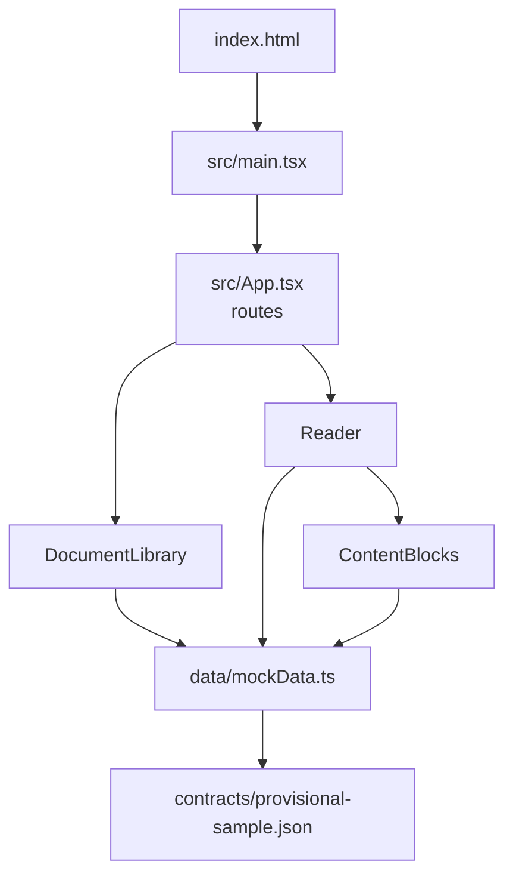

# Frontend guide

The frontend is a React single-page app in `frontend/`. It shows a document library and a manual reader.

> **Important:** the frontend currently displays mock data only. It contains no network calls. The backend API exists but is not yet connected (planned as the milestone the project plan calls Step 5I).

- [Architecture](#architecture)
- [Routing](#routing)
- [Components](#components)
- [TypeScript types](#typescript-types)
- [Mock data](#mock-data)
- [Deep links](#deep-links)
- [API integration readiness](#api-integration-readiness)
- [Styling and responsive behaviour](#styling-and-responsive-behaviour)
- [Testing](#testing)

## Architecture



| File | Role |
|---|---|
| `frontend/index.html` | Page shell with the `#root` element, viewport and `theme-color` meta tags |
| `frontend/src/main.tsx` | Renders `<App />` inside React `StrictMode` and imports `styles.css` |
| `frontend/src/App.tsx` | Defines routes; exports `AppRoutes` (used by tests) and the default `App` wrapped in `BrowserRouter` |
| `frontend/src/components/DocumentLibrary.tsx` | Library page |
| `frontend/src/components/Reader.tsx` | Reader page, outline and deep-link behaviour |
| `frontend/src/components/ContentBlocks.tsx` | Renders a topic's content blocks |
| `frontend/src/data/mockData.ts` | Types and mock data functions |
| `frontend/src/styles.css` | All styles |
| `frontend/src/App.test.tsx` | All frontend tests |

There is no global state library. State lives in React component state inside the reader.

## Routing

Defined in `AppRoutes` in `frontend/src/App.tsx` using React Router.

| Path | Component | Notes |
|---|---|---|
| `/` | `DocumentLibrary` | Home page |
| `/reader/:docId/:revision` | `Reader` | Optional `?nodeId=<permanent id>` query for deep links |
| `*` | `DocumentLibrary` | Unknown paths fall back to the library |

## Components

### `DocumentLibrary`

- Calls `getDocumentLibrary()` and renders one card for every revision of every document.
- Each card shows the title, document ID, document type, revision, revision date and effective date, with an "Open reader" link to `/reader/{docId}/{revision}`.
- A footer line states "Prototype data from the provisional sample."
- It does not display the revision `status` field, even though the data includes it.

### `Reader`

`Reader.tsx` exports `Reader` and contains several internal components.

- **`Reader`** reads `docId` and `revision` from the URL and `nodeId` from the query string, then loads the navigation tree. If the document or revision is unavailable it shows a "Document unavailable" page with a link back to the library.
- **`ReaderWorkspace`** holds the reader state:
  - the selected topic (the deep-link target if there is one, otherwise the first topic),
  - which chapters and sections are expanded (the first of each to begin with),
  - whether the navigation drawer is open,
  - which checklist items are ticked,
  - which element is currently highlighted.
- **`OutlineChapter`, `OutlineSection`, `OutlineTopic`** render the three-level outline. Chapters and sections are buttons with `aria-expanded`; the active topic has `aria-current="page"`.
- **Layout:** a sticky toolbar ("Pilot EFB", "Back to library", "Open navigation"), the outline, the topic heading with revision and dates, the content, and a footer showing the document classification and revision details.

Selecting a topic clears the `nodeId` query, removes any highlight and closes the drawer.

### `ContentBlocks`

Exports `ContentBlocks`, which switches on each block's `type`:

| Block type | Rendered as |
|---|---|
| `para` | A paragraph |
| `note`, `caution`, `warning` | An `<aside>` callout with a text label ("Note", "Caution", "Warning") |
| `list` | A bulleted list |
| `table` | A table in a keyboard-focusable scroll region; rows flagged `header` render as column headers |
| `checklist` | A list of checkboxes, each showing a challenge and a response |

- **Element IDs:** every block, and every checklist item, is rendered with its permanent ID as the HTML `id`. This is what makes scroll-to-target possible.
- **Cross-references:** `InlineSegments` renders text and `xref` segments in order. A cross-reference becomes a link to `?nodeId=<targetId>` only if the target exists in the available data. Otherwise it is shown as plain text followed by "Not available in this prototype."
- **Checklists:** ticks are stored in `ReaderWorkspace` state, keyed by check ID. They survive switching topics but are lost on reload. Nothing is saved.
- **Callout colours:** the three callout types differ only in a neutral grey border shade and their label. The dataset contains no real `warning` blocks, so no severity colour scheme has been decided.

## TypeScript types

All shared types are exported from `frontend/src/data/mockData.ts`. They mirror the JSON shapes in the provisional contract, which are also the shapes the backend returns.

| Type | Describes |
|---|---|
| `Metadata` | The ten XML `meta` fields |
| `ChapterOutline`, `SectionOutline`, `TopicOutline` | Navigation tree levels |
| `ContentBlock` | Union of text, list, table and checklist blocks, discriminated by `type` |
| `TopicContent` | A topic with `chapterId`, `sectionId` and `blocks` |
| `LibraryDocument` | A document with `availableRevisions` |
| `NavigationResponse` | Shape of the navigation endpoint |
| `TopicResponse` | Shape of the topic endpoint |

The outline and topic types include an optional `mock` flag. It is a frontend-only marker and is not part of the API.

`frontend/tsconfig.json` enables `strict`, `noUnusedLocals`, `noUnusedParameters` and `noFallthroughCasesInSwitch`. `resolveJsonModule` allows the JSON sample to be imported directly.

## Mock data

`mockData.ts` imports `contracts/provisional-sample.json` at build time and exposes four functions:

| Function | Returns | Backend equivalent |
|---|---|---|
| `getDocumentLibrary()` | The documents in the sample | `GET /api/documents/` |
| `getNavigationTree(docId, revision)` | The sample outline plus a mock chapter | `GET .../navigation/` |
| `getTopic(docId, revision, topicId)` | One of two topics | `GET .../topics/{topicId}/` |
| `resolveAvailableTargetId(docId, revision, targetId)` | The topic containing a target ID, if any | Planned resolver endpoint (not implemented) |

What the mock data contains:

- **One document and revision:** FM-S100 Rev 2. Any other document or revision throws an error, which the reader shows as "Document unavailable".
- **One real topic:** `fm100-t0340` "Autothrottle Crew Awareness", inside chapter `fm100-c05` and section `fm100-s019`.
- **One labelled mock topic:** `fm100-t1086` "Transponder Reset Guidance", placed in an invented chapter called "Examples" so the table renderer can be demonstrated. The chapter, section and topic are marked with a "MOCK" badge in the UI.

The functions are synchronous. Real API calls will be asynchronous, so integration will require loading and error states that do not exist yet.

## Deep links

Implemented in the frontend only, against mock data.

1. A URL such as `/reader/FM-S100/2?nodeId=fm100-p03219` is opened.
2. `resolveAvailableTargetId` searches the two available topics for a topic, block or checklist item with that ID.
3. The reader selects the containing topic and expands its chapter and section.
4. The target element is scrolled into view and highlighted for about 2.2 seconds.
5. If the ID is not found, the reader shows "This target is not available in this prototype."

Links always use the permanent ID. Nothing in the frontend resolves by number, title or page.

## API integration readiness

**Already in place**

- `frontend/vite.config.ts` proxies `/api` to `http://127.0.0.1:8000` during development.
- The types match the implemented response shapes.
- Components reach data only through the four functions above, so there is one module to replace.

**Still required**

- Replace the mock functions with requests to the API and make callers asynchronous.
- Add loading, empty and error states, mapping the API error codes to messages.
- Display revision status (`current`, `upcoming`, `superseded`) so the effective revision is unmistakable.
- Resolve deep links and cross-references across the full manual, which depends on the backend resolver (Step 5H).
- Remove the mock "Examples" chapter and the "Prototype data" notice.
- Decide how the frontend finds the API in a production build, where the Vite proxy does not exist.

## Styling and responsive behaviour

All styles are in `frontend/src/styles.css`: plain CSS with a handful of custom properties for colours. There is no CSS framework.

| Screen | Behaviour |
|---|---|
| Default (narrow) | The outline is hidden. "Open navigation" slides it in as a drawer over a dimmed backdrop |
| 900px and wider, or 760px and wider in landscape | Two-column layout with the outline as a sticky sidebar. The drawer toggle, close button and backdrop are hidden |
| 420px and narrower | Library card headings stack and details use two columns |

Other touch and accessibility details in the code:

- Visible focus outlines on buttons, links, inputs and focusable regions.
- Tap highlight colour removed for buttons and links.
- Labelled regions (`aria-label`) for navigation, content, tables and checklists.
- Reader text width capped for readability.

**Not verified:** the layout has not been tested on a real iPad or any physical device. Tests run in jsdom, which does not apply CSS layout or media queries.

## Testing

Run from `frontend/`:

```sh
npm test           # all tests, once
npx tsc -b         # type check
npm run build      # type check and production build
```

There is no separate type-check script in `package.json`; `npx tsc -b` is the direct command, and `npm run build` runs it first.

Result at the time of writing: **10 tests in 1 file, all passing**; type check clean; build succeeded.

All tests are in `frontend/src/App.test.tsx`, using Vitest, React Testing Library and jsdom:

| Group | Test | Checks |
|---|---|---|
| Document library | Shows only the document and revision from the provisional sample | Library content |
| Document library | Opens the selected revision in the reader | Navigation from library to reader |
| Reader | Renders and expands the source navigation hierarchy | Outline |
| Reader | Renders topic blocks in source order and shows unavailable xrefs as text | Block order, cross-reference fallback |
| Reader | Renders ordered list items as bullets | Lists |
| Reader | Renders the contract table with a header row in source order | Tables, mock badges |
| Reader | Renders checklist checks in source order with interactive controls | Checklists |
| Reader | Scrolls to and highlights a requested checklist check | Deep link, highlight timeout |
| Reader | Supports warning blocks without implying a severity colour | Warning callout |
| Reader | Links cross-references only when their target exists in local data | Cross-reference links |

**Not covered:** real browsers, real devices, visual layout, accessibility audits, network behaviour and anything involving the backend.
