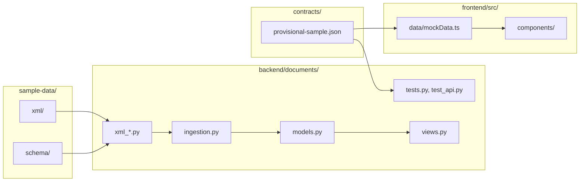

# Repository guide

A folder-by-folder and file-by-file explanation of the Pilot EFB repository. Every path below is tracked in Git and was opened and read while writing this guide.

The repository has 20 folders. Files that are generated locally and ignored by Git (`node_modules/`, `dist/`, `.venv/`, `__pycache__/`, `db.sqlite3`, `.env`, `.vite/`, `*.tsbuildinfo`) are not described.

Each file is labelled with its kind: **production code**, **test**, **configuration**, **fixture** (sample or reference data), or **documentation**.

- [Root](#root)
- [`.github/`](#github)
- [`backend/`](#backend)
- [`frontend/`](#frontend)
- [`contracts/`](#contracts)
- [`docs/`](#docs)
- [`sample-data/`](#sample-data)
- [How the parts connect](#how-the-parts-connect)

## Root

| File | Kind | What it does |
|---|---|---|
| `README.md` | Documentation | Project overview and entry point to the rest of the documentation |
| `CLAUDE.md` | Configuration | Project rules read by Claude Code: synthetic data only, never change node IDs, React never parses XML, folder ownership, parser build order, branch workflow |
| `.gitignore` | Configuration | Excludes dependencies, build output, virtual environments, Python bytecode, the SQLite database, `.env` and OS files |

## `.github/`

**Purpose:** GitHub-specific configuration. Used by GitHub Copilot.

| File | Kind | What it does |
|---|---|---|
| `.github/copilot-instructions.md` | Configuration | The same project rules as `CLAUDE.md`, in the location GitHub Copilot reads |

There are no workflow files, so no continuous integration runs.

## `backend/`

**Purpose:** the Django project. It validates and ingests XML and serves the REST API. Owned by Backend Development under the project rules.

| File | Kind | What it does |
|---|---|---|
| `backend/manage.py` | Production code | Django's command-line entry point. Sets `DJANGO_SETTINGS_MODULE` to `config.settings` and runs the requested command |
| `backend/requirements.txt` | Configuration | Three dependencies with version ranges: Django, Django REST Framework and lxml |
| `backend/.env.example` | Configuration | Example values for `DJANGO_SECRET_KEY`, `DJANGO_DEBUG` and `DJANGO_ALLOWED_HOSTS`. Contains no credentials. No code reads these variables at present |

### `backend/config/`

**Purpose:** the Django project package. Used by `manage.py` and by any WSGI or ASGI server.

| File | Kind | What it does |
|---|---|---|
| `backend/config/__init__.py` | Production code | Empty package marker |
| `backend/config/settings.py` | Configuration | All Django settings. Installs `rest_framework` and `documents`; configures SQLite; sets the REST framework to JSON-only, unauthenticated and `AllowAny`; registers `documents.api_errors.api_exception_handler` and `ApiNotFoundMiddleware`; time zone UTC. Values are hardcoded for local development |
| `backend/config/urls.py` | Production code | The URL table. Maps `admin/`, `api/health/`, `api/documents/`, `api/documents/<doc_id>/revisions/<revision>/navigation/` and `.../topics/<topic_id>/` to views imported from `documents.views` |
| `backend/config/wsgi.py` | Production code | Exposes `application` for WSGI servers; used by `runserver` |
| `backend/config/asgi.py` | Production code | Exposes `application` for ASGI servers; not otherwise used |

### `backend/documents/`

**Purpose:** the only Django app. It contains the XML pipeline, the data model, ingestion, the API and all backend tests.

#### XML pipeline

| File | Kind | Main contents | Depends on |
|---|---|---|---|
| `backend/documents/xml_validation.py` | Production code | `secure_xml_parser()`, `validate_xml()`, dataclasses `XmlValidationIssue` and `ValidationResult`, constants `PROJECT_ROOT`, `DEFAULT_XML_PATH`, `DEFAULT_XSD_PATH` | lxml |
| `backend/documents/xml_metadata.py` | Production code | `extract_metadata()`, dataclasses `ExtractedDocumentMetadata` and `MetadataExtractionResult` | `xml_validation` |
| `backend/documents/xml_hierarchy.py` | Production code | `extract_hierarchy()`, `build_navigation()`, typed dictionaries `HierarchyNode`, `ChapterNavigation`, `SectionNavigation`, `TopicNavigation`, dataclass `HierarchyExtractionResult` | `xml_validation` |
| `backend/documents/xml_content.py` | Production code | `extract_all_topic_content()`, `extract_topic_content()`, block types `TextBlock`, `ListBlock`, `TableBlock`, `ChecklistBlock`, `TopicContent`, dataclasses `SkippedContentBlock`, `ContentExtractionResult`, `TopicContentResult`, constants `SUPPORTED_BLOCK_TYPES`, `XML_NAMESPACE` | `xml_validation` |
| `backend/documents/xml_normalization.py` | Production code | `assemble_normalized_document()`, typed dictionaries `NormalizedDocumentPayload`, `IngestionReport`, `NormalizedDocumentResult` | `xml_metadata`, `xml_hierarchy`, `xml_content`, `xml_validation` |

- **`xml_validation.py`** is the foundation: every other pipeline module imports its parser, its issue type and its default paths.
- **`xml_metadata.py`, `xml_hierarchy.py` and `xml_content.py`** are independent of each other. Each validates the file, parses it and extracts one aspect.
- **`xml_normalization.py`** combines the three into one payload and a separate report.

#### Persistence and ingestion

| File | Kind | Main contents | Depends on |
|---|---|---|---|
| `backend/documents/models.py` | Production code | Models `Document`, `DocumentVersion`, `DocumentNode` (with `NodeType` choices and a `clean()` method), six constraints and two indexes | Django ORM |
| `backend/documents/ingestion.py` | Production code | `ingest_xml()`, `validate_version_tree()`, `get_normalized_document()`, dataclass `IngestionResult`, exception `DocumentTreeIntegrityError` | `models`, `xml_normalization`, `xml_content` |
| `backend/documents/management/commands/ingest_xml.py` | Production code | `Command`, the `manage.py ingest_xml <path> [--replace]` command. Prints a summary or the list of issues | `ingestion` |
| `backend/documents/management/__init__.py`, `backend/documents/management/commands/__init__.py` | Production code | Empty package markers that let Django discover the command | — |

#### API

| File | Kind | Main contents | Depends on |
|---|---|---|---|
| `backend/documents/views.py` | Production code | Views `health`, `document_library`, `navigation`, `topic_content`; helpers `_get_version`, `_document_identity`, `_topic_parents` | `models`, `ingestion`, `revision_status`, `api_errors`, Django REST Framework |
| `backend/documents/revision_status.py` | Production code | `current_date()`, `derive_statuses()`, constants `CURRENT`, `UPCOMING`, `SUPERSEDED` | Django time zone utilities |
| `backend/documents/api_errors.py` | Production code | Exception `ApiError`, `error_body()`, `api_exception_handler()`, class `ApiNotFoundMiddleware`, error code constants | Django REST Framework |

- **`views.py`** reads only from the database. It reuses `validate_version_tree` and `DocumentTreeIntegrityError` from `ingestion.py` so a corrupted stored tree becomes a sanitized 500 response.
- **`revision_status.py`** has a single clock function so tests can fix the date.
- **`api_errors.py`** is wired in through `settings.py`, not imported by `urls.py`.

#### App plumbing

| File | Kind | What it does |
|---|---|---|
| `backend/documents/__init__.py` | Production code | Empty package marker |
| `backend/documents/apps.py` | Configuration | `DocumentsConfig`, the app's Django configuration |

There is no `admin.py`, `serializers.py` or app-level `urls.py`. Models are not registered with the Django admin, responses are built as plain dictionaries in the views, and routes live in `backend/config/urls.py`.

#### Migrations

**Purpose:** `backend/documents/migrations/` records the database schema history. Applied by `manage.py migrate`.

| File | Kind | What it does |
|---|---|---|
| `backend/documents/migrations/0001_initial.py` | Production code | Creates the three tables, the `unique_document_revision` and `unique_version_node_id` constraints, and two indexes |
| `backend/documents/migrations/0002_documentnode_unique_version_position_and_more.py` | Production code | Adds `unique_version_position`, `unique_version_parent_sequence` and the `documentnode_valid_parent_reference` check |
| `backend/documents/migrations/0003_documentnode_unique_version_root_sequence.py` | Production code | Adds `unique_version_root_sequence` for chapters |
| `backend/documents/migrations/__init__.py` | Production code | Empty package marker |

All three were generated by Django 5.2.18.

#### Tests

| File | Kind | What it does |
|---|---|---|
| `backend/documents/tests.py` | Test | 73 tests in 9 classes covering the health endpoint, each pipeline step, database ingestion, failure and rollback paths, and tree validation. Defines `MINIMAL_VALID_MANUAL`, a small synthetic XML document, and builds further fixtures in temporary directories |
| `backend/documents/test_api.py` | Test | 48 tests in 7 classes covering revision status rules, each endpoint, error codes, HTTP methods, admin and session behaviour, and the real FM-S100 Rev 2 sample through the API. Defines helper builders such as `make_document`, `make_version`, `make_node` and `make_small_tree` |

Both files read `sample-data/xml/FM-S100_Rev2.xml` and the XSD. `test_api.py` and `tests.py` also read `contracts/provisional-sample.json` to confirm that real output matches the contract examples.

## `frontend/`

**Purpose:** the React, TypeScript and Vite single-page app. Owned by Frontend Development under the project rules.

| File | Kind | What it does |
|---|---|---|
| `frontend/index.html` | Production code | The single HTML page: `#root` element, viewport and `theme-color` meta tags, and the script tag for `src/main.tsx` |
| `frontend/package.json` | Configuration | Package name, the `dev`, `build`, `test` and `preview` scripts, and dependency ranges |
| `frontend/package-lock.json` | Configuration | Exact resolved versions of every dependency (npm lockfile format 3). Generated by npm; not edited by hand |
| `frontend/tsconfig.json` | Configuration | TypeScript compiler options: strict mode, ES2022 target, bundler module resolution, JSON imports, no emit |
| `frontend/vite.config.ts` | Configuration | Enables the React plugin, sets the Vitest environment to jsdom, and proxies `/api` to `http://127.0.0.1:8000` in development |

### `frontend/src/`

**Purpose:** all application source code.

| File | Kind | Main contents | Depends on |
|---|---|---|---|
| `frontend/src/main.tsx` | Production code | Mounts `<App />` in `StrictMode` | `App.tsx`, `styles.css` |
| `frontend/src/App.tsx` | Production code | `AppRoutes` (the route table) and default export `App` (routes inside `BrowserRouter`) | `DocumentLibrary`, `Reader`, React Router |
| `frontend/src/styles.css` | Production code | All styles: colour variables, library cards, reader toolbar, outline, content blocks, callouts, tables, checklists, target highlight, and two media queries | — |
| `frontend/src/App.test.tsx` | Test | 10 tests for the library and reader, rendered through `AppRoutes` inside a `MemoryRouter` | `App.tsx`, `ContentBlocks`, `mockData`, Vitest, React Testing Library |

### `frontend/src/components/`

**Purpose:** the React components. Used by `App.tsx`.

| File | Kind | Main contents | Depends on |
|---|---|---|---|
| `frontend/src/components/DocumentLibrary.tsx` | Production code | `DocumentLibrary`: one card per document revision with an "Open reader" link | `mockData.getDocumentLibrary` |
| `frontend/src/components/Reader.tsx` | Production code | `Reader` (exported), plus internal `ReaderWorkspace`, `OutlineChapter`, `OutlineSection`, `OutlineTopic` and `firstTopicId` | `mockData`, `ContentBlocks`, React Router |
| `frontend/src/components/ContentBlocks.tsx` | Production code | `ContentBlocks` (exported), plus internal `InlineSegments`, `TextBlockView`, `ListView`, `TableView`, `ChecklistView` | `mockData.resolveAvailableTargetId`, types from `mockData` |

### `frontend/src/data/`

**Purpose:** the frontend's only data source at present.

| File | Kind | Main contents | Depends on |
|---|---|---|---|
| `frontend/src/data/mockData.ts` | Production code (mock) | Exported types (`Metadata`, `ChapterOutline`, `SectionOutline`, `TopicOutline`, `ContentBlock`, `TopicContent`, `TopicResponse`, `LibraryDocument`, `NavigationResponse`) and functions `getDocumentLibrary`, `getNavigationTree`, `getTopic`, `resolveAvailableTargetId` | `contracts/provisional-sample.json` |

This file reaches outside `frontend/` with a relative import of `../../../contracts/provisional-sample.json`. The contract sample is therefore bundled into the frontend build.

## `contracts/`

**Purpose:** the shared agreement between frontend and backend on JSON shapes. Changes require the project owner's approval.

| File | Kind | What it does |
|---|---|---|
| `contracts/provisional-contract.md` | Documentation | Describes four proposed endpoints (library, navigation, topic, resolve-node), the error shape, how React should consume responses, and unresolved design decisions. Marked provisional. Its "PROPOSED, not implemented" labels predate the API |
| `contracts/provisional-sample.json` | Fixture | Example payloads taken from FM-S100 Rev 2. Top-level keys: `contractStatus`, `source`, `documentLibraryExample`, `navigationExample`, `topicContentExample`, `tableExample`, `paragraphDeepLinkExample`, `checklistItemDeepLinkExample` |
| `contracts/.gitkeep` | Configuration | Empty placeholder from the initial project layout |

`provisional-sample.json` has two consumers: the frontend imports it as its mock data, and the backend tests compare real output against it.

## `docs/`

**Purpose:** project documentation.

| File | Kind | What it does |
|---|---|---|
| `docs/REPOSITORY_GUIDE.md` | Documentation | This guide |
| `docs/TECH_STACK.md` | Documentation | Technologies, versions and evidence |
| `docs/BACKEND_GUIDE.md` | Documentation | Backend architecture, pipeline, models, API and tests |
| `docs/FRONTEND_GUIDE.md` | Documentation | Frontend architecture, components, mock data and tests |
| `docs/DEVELOPMENT_GUIDE.md` | Documentation | Setup, commands, workflow and troubleshooting |
| `docs/PROJECT_STATUS.md` | Documentation | Implemented and planned features, limitations and open decisions |
| `docs/xml-inspection.md` | Documentation | A 16-section inspection of FM-S100 Rev 2: namespace, metadata, hierarchy, block types and counts, IDs, cross-references, checklists, manifest, deep-link samples, PDF outline findings, XSD constraints and open questions. Written before ingestion existed |

### `docs/decisions/`

**Purpose:** reserved for decision records. It contains only `docs/decisions/.gitkeep`; no decisions have been recorded.

## `sample-data/`

**Purpose:** the synthetic dataset supplied for the project. Every document is fictional and marked as not for operational use. Used by the backend pipeline, by tests and as reference material.

| File | Kind | What it does |
|---|---|---|
| `sample-data/README.md` | Documentation | The dataset's own description: contents, the `id` versus `number` rule, PDF navigation expectations, and revision test scenarios |
| `sample-data/manifest.json` | Fixture | A `generated` date and eight document entries, each with `docId`, `title`, `docType`, `applicability`, `revision`, `revisionDate`, `effectiveDate`, `owner`, `changeSummary`, `xml`, `pdf`, `pdfPages` and `topics`. No code reads it |
| `sample-data/deep_link_samples.json` | Fixture | Seven sample deep-link targets for FM-S100 Rev 2 (six topics, one paragraph), each with the expected number and title. No code reads it |

### `sample-data/xml/`

**Purpose:** XML source for every document and revision. These are the source of truth and the input to `ingest_xml`.

| File | Document | Revision | Topics | Approx. size |
|---|---|---:|---:|---:|
| `sample-data/xml/FM-S100_Rev0.xml` | Sample Flight Manual, SAMPLE-100 | 0 | 1,188 | 5.4 MB |
| `sample-data/xml/FM-S100_Rev1.xml` | Sample Flight Manual, SAMPLE-100 | 1 | 1,194 | 5.4 MB |
| `sample-data/xml/FM-S100_Rev2.xml` | Sample Flight Manual, SAMPLE-100 | 2 | 1,193 | 5.4 MB |
| `sample-data/xml/FM-S100_Rev3.xml` | Sample Flight Manual, SAMPLE-100 | 3 | 1,193 | 5.4 MB |
| `sample-data/xml/FM-S200_Rev4.xml` | Sample Flight Manual, SAMPLE-200 | 4 | 293 | 1.3 MB |
| `sample-data/xml/FOM_Rev12.xml` | Sample Flight Operations Manual | 12 | 360 | 1.5 MB |
| `sample-data/xml/WOM_Rev7.xml` | Sample Worldwide Operations Manual | 7 | 184 | 0.8 MB |
| `sample-data/xml/MEL-S100_Rev9.xml` | Sample Minimum Equipment List | 9 | 112 | 0.2 MB |

- `FM-S100_Rev2.xml` is the default input of the pipeline and the file the automated tests use.
- Topic counts are from `sample-data/manifest.json` and matched the ingestion output for every file.
- `sample-data/xml/.gitkeep` is an empty placeholder.

### `sample-data/pdf/`

**Purpose:** a PDF rendition of each XML file, with a bookmark outline. No code reads these yet; they are for the planned PDF viewer.

Files: `FM-S100_Rev0.pdf`, `FM-S100_Rev1.pdf`, `FM-S100_Rev2.pdf`, `FM-S100_Rev3.pdf`, `FM-S200_Rev4.pdf`, `FOM_Rev12.pdf`, `MEL-S100_Rev9.pdf`, `WOM_Rev7.pdf`, plus an empty `.gitkeep`. Page counts are listed in `sample-data/manifest.json`.

### `sample-data/pdf-only/`

**Purpose:** small documents that have no XML source, for testing PDF-only handling.

Files: `Bulletin_26-01.pdf`, `Bulletin_26-02.pdf`, plus an empty `.gitkeep`.

### `sample-data/schema/`

**Purpose:** the XML schema. Used by `backend/documents/xml_validation.py`.

| File | Kind | What it does |
|---|---|---|
| `sample-data/schema/sample-fltpub.xsd` | Fixture | Defines the `manual` → `meta` → `chapter` → `section` → `topic` → block structure in namespace `urn:sample:fltpub:1.0`; the `NodeId` type; the block types `para`, `note`, `caution`, `warning`, `list`, `table`, `checklist` and `melItem`; and `xref` targets as ID references |
| `sample-data/schema/.gitkeep` | Configuration | Empty placeholder |

### `sample-data/revision-keys/`

**Purpose:** answer keys describing what changed between FM-S100 revisions, for testing revision comparison and annotation carry-forward. No code reads these yet.

| File | Kind | What it does |
|---|---|---|
| `sample-data/revision-keys/FM-S100_Rev0_to_Rev1.json` | Fixture | Topics: 6 added, 40 modified. Blocks: 58 added, 40 modified |
| `sample-data/revision-keys/FM-S100_Rev1_to_Rev2.json` | Fixture | Topics: 4 added, 5 removed, 8 moved, 25 modified. Blocks: 41 added, 32 removed, 25 modified |
| `sample-data/revision-keys/FM-S100_Rev2_to_Rev3.json` | Fixture | Topics: 2 added, 2 removed, 2 moved, 11 modified. Blocks: 19 added, 12 removed, 11 modified |
| `sample-data/revision-keys/annotation_test_cases_Rev1_to_Rev2.json` | Fixture | Four annotation scenarios (unchanged, changed, moved, removed), each with an anchor node ID and the expected behaviour |
| `sample-data/revision-keys/.gitkeep` | Configuration | Empty placeholder |

## How the parts connect

- **Data into the backend:** `sample-data/xml/` and `sample-data/schema/` feed the pipeline, which `ingestion.py` writes to the tables defined in `models.py`. `views.py` reads those tables.
- **The contract as a shared check:** backend tests assert that real output equals the examples in `contracts/provisional-sample.json`, and the frontend renders those same examples. This is what keeps the two sides aligned while they are not yet connected.
- **The missing link:** nothing in `frontend/` calls `views.py`. Connecting them is the planned live integration step.
